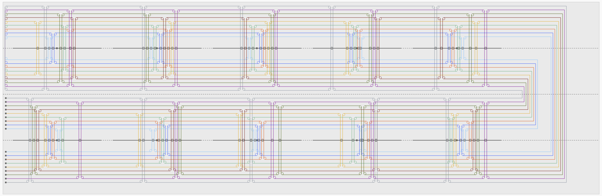

### 九元連立方程式求解機のアニメーション
九元連立方程式求解機のアニメーションを作成し、その動作を確認した。



---

#### 動作方法
```bash
# 1. GitHubからリポジトリをクローン
git clone <リポジトリのURL>

# 2. クローンしたディレクトリへ移動
cd <リポジトリのディレクトリ名>

# 3. 依存関係をインストール
npm install

# 4. 開発用ローカルサーバーを起動
npm run dev
```
---

#### 九元連立方程式求解機とは
>  計算機研究開発の黎明期に製作された大型のアナログ式計算機である．真鍮製のバーの角度を変えることによって，ベルトの長さを変化させ，複雑な連立方程式を解くことができる．
 米国のJ.ウィルバー（John B. Wilbur）は，1936年に土木の構造解析や経済学上の計算を行える計算機械を考案，製作した．本機はその情報を元に，東京帝国大学航空研究所の佐々木達治郎をはじめ，志賀亮，三井田らが1944年に製作した国内初の大型計算機械である．
 九元連立一次方程式は，一般に9個の未知数と1個の定数を含んだ9個の一次方程式からなっている．本機は鉄のフレームに角度を変えられる真鍮のバーが取り付けられており，その角度が各未知数に対応し，バー上のプーリーに架けられた鉄のテープの長さが各方程式を表している．バーを動かし，テープの長さを読み取ることにより方程式の解を求めることができる．

https://museum.ipsj.or.jp/heritage/kyugen.html より引用

#### [参考] アニメーションページ
* https://www.iijlab.net/~ew/eqsolv.html

#### [参考] 解説ページ
* https://museum.ipsj.or.jp/computer/dawn/0057.html

#### [参考] 計算方法の説明
* https://www.kahaku.go.jp/research/publication/sci_engineer/download/24/BNSM_E2403.pdf
* https://museum.ipsj.or.jp/guide/pdf/magazine/IPSJ-MGN500914.pdf
* https://www.cs.princeton.edu/~ken/wilbur36.pdf

#### [参考] ブログ記事
* https://parametron.blogspot.com/2009/04/blog-post.html
* https://parametron.blogspot.com/search/label/%E9%B6%B4%E4%BA%80%E9%B4%89%E7%AE%97
